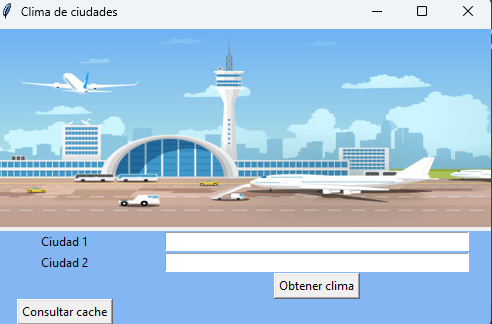
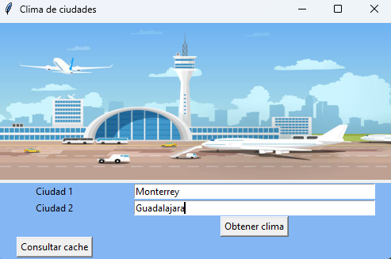
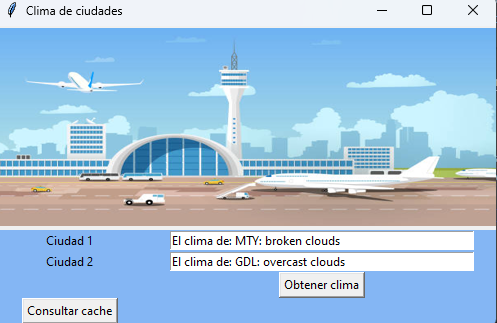
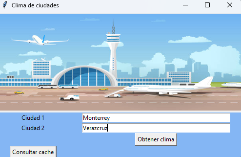
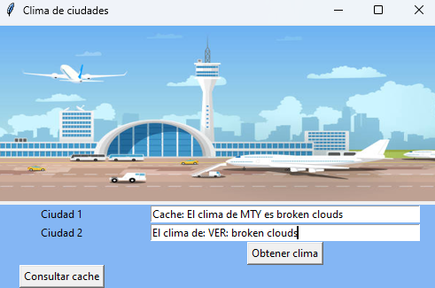

# Taranis: Tu App de Clima de Confianza





---

### La mejor manera de conocer el clima

**Taranis** es la app definitiva para consultar el clima en tiempo real en dos ubicaciones diferentes para tener consideraciones en un vuelo. Con una interfaz simple pero potente, esta aplicación te brindánda la información meteorológica más precisa y rápida disponible.

### Características clave:

- **Consultas en tiempo real a OpenWeather API**  
  Usamos el poder de la API de OpenWeather para brindarte predicciones meteorológicas detalladas y actualizadas, ¡todo con solo introducir el nombre de dos ciudades!

- **Optimización inteligente con caché**  
  Ahorra tiempo y recursos. Si consultas el clima de las mismas ciudades repetidamente, **Taranis** guarda las respuestas en caché, evitando consultas innecesarias a la API.

- **Corrección automática de errores en nombres de ciudades**  
  ¿Te equivocaste al escribir el nombre de una ciudad? No te preocupes. **Taranis** es lo suficientemente inteligente como para detectar errores comunes y sugerir la ciudad correcta, asegurando que siempre obtengas la información que necesitas.

¡Descarga **Taranis** hoy y nunca más te preguntes qué clima te espera en tu próxima parada!

---

## Librerias requeridas
Las librerias que se necesitan para poder ejecutar 

- tkinter
    Esta libreria nos ayudara a hacer una interfaz grafica con la cual el usuario podra interactuar, pidiendo el clima.
    ```bash
    pip install tk
    ```
- pillow
    Esta libreria nos ayudara a cargar imagenes de distintos formatos y ponerlas en nuestra ventana tkinter
    ```bash
    pip install pillow
    ```

- difflib
    Esta libreria sirve para comparar secuencuencias, nos va a ayudar a comparar las ciudades que pase como input el usuario y asignarlas a un codigo de la ciudad, aunque el usuario pase mal escrita la ciudad. Ademas, este modulo ya viene incluido con python3.

- pandas
    Esta libreria nos ayudara a manejar el dataset proporcionado en clase.
    ```bash
    pip install pandas
    ```

- numpy
    Esta libreria nos sirve para poder hacer operaciones matematicas con los datos que se obtienen de la api.
    ```bash
    pip install numpy
    ```
- request
    Esta libreria nos va a ayudar a hacer las consultas a la API y asi obtener los climas buscados.
    ```bash
    pip install request
    ```

## Modo de uso

Para poder correr esta maravillosa app, te debes posicionar en la carpeta del proyecto y sea si haces git clone del proyecto o lo hayas descargado.

Una vez estando ahi, se necesita correr el scrip **app_grafica.py**, de la manera tradicional, dependiendo si estas en windows o linux sera alguno de estos dos comandos:
```bash
python3 app_grafica.py
python app_grafica.py
```
obtendras una ventana tkinter como esta:


---
## Probando app
Probemos la app, vamos a ajecutarla y despues pasemosle dos ciudades correctamente:



Le damos al boton de Obtener clima:



Notemos que nos da el clima en el mismo entry donde escribimos la ciudad, ahora veamos el cache dando click al boton de consultar cache:

![alt text]ImagenesReadme/(ImagenesReadme/image-3.png)

Veamos que, en efecto guardo las dos ciudades correctamente y su respectivo clima.

Ahora hagamos otra prueba pasandole una ciudad escrita mal y otra ciudad que ya le hemos pasado:



Veamos que ingresamos monterrey que ya habia sido consultada antes y ademas consultamos Veracruz que no ha sido consultado pero veamos que lo hemos escrito mal, veamos que nos regresa:



Notemos que nos devuelve el mismo resultado de Monterrey, pero en esta ocación nos muestra que fue sacado del cache. Y tambien notemos que a pesar de que escribimos Veracruz de manerra incirrecta, nos devolvio el resultado esperado.

---
## Pruebas de codigo

- Prueba cache
    Esta prueba la hicimos para verificar si realmente cuando hay consultas que ya se han hecho antes, devolvemos el resultado del cache o si estabamos haciendo consultas inecesarias a la API.

    


    Notemos que cuando hacemos una petición a la API (consulta nueva), simplemente se nos devolvera el string pedido de la manera "El clima de {ciudad}: {clima}". Pero si nuestra consulta ya ha sido procesada antes nos devolvera "Cache: El clima de {ciudad} es {clima}", esto ha sido puesto de manera intencional para poder verificar que parte de nuestro codigo es el que se ejecuta cuando hay consultas nuevas o ya existentes.

- Prueba detección de errores de escritura
    Esta prueba la hicimos para estar probando que tanto nos podemos equivocar a la hora de pasarle una ciudad al programa, hicimos pruebas con mayusculas, minusculas y con 1 o 2 erorres en la palabra.

    Para mejor visualización de estos tests, en la carpeta test, se puede encontrar el archivo **test_errores_escritura.py** y se puede correr mediante:
    ```bash
    pytest test_errores_escritura.py
    ```

---
## Futuras mejoras

1. La primer mejora que buscamos a futuro es pasar la interface a una app web, ya sea usando Flask o Django ya que en esta fase beta buscamos mas que nada conseguir el correcto funcionamiento y logica del programa, ya conseguido esto, a futuro podemos enfocarnos en hacer una pagina mucho mas bonita y mas amigable al usuario.

1. La segunda mejora que buscamos a futuro es poder dar resultados a las consultas en español o tambien una idea es poder agregar la opción de poder elegir la app en español o en ingles.

1. La tercera y ultima mejora que tenemos planeada es acerca del cache, nuestra idea es poder guardar la hora de la consulta tambien y cuando se haga una consulta igual, revise en el cache si la pasada consulta fue hace mas de 3-4 horas, sí es asi,se vuelve a hacer una consulta a la API, ya que sino, nos devolvera el valor del cache de hace 3-4 horas, que esto no seria funcional ya que el clima es muy cambiante y el clima de hace 3-4 horas no nos serviria.


